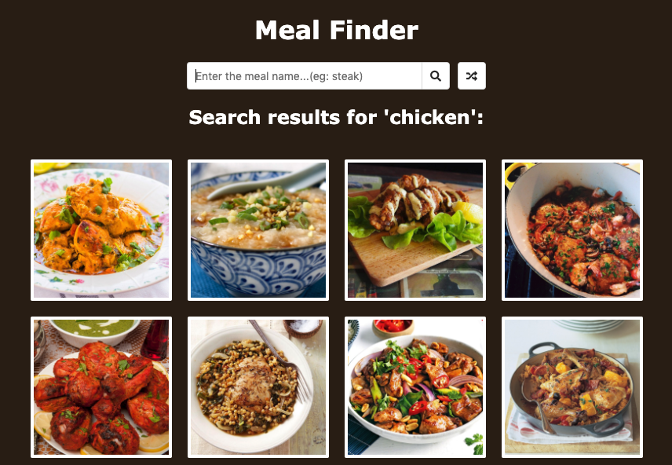

# 10-meal-finder

### :eyes: demo: [10-demo](https://sincerity628.github.io/back-to-simple/10-meal-finder/index.html)

---

### :laughing: brief intro
1. search for a meal:


- (no result)


2. click on one of the results


3. get the recipe


4. click on the random button


5. get a random meal


---

### :smiley: cool stuff
1. responsible

- PC:



- Ipad:


- Phone:


---

### :poop: add the hover cover effect
result:
- normal:


- hover:


template:
```html
<body>
  <div class="container">
    
    <div class="info">
      <h3>detail text</h3>
    </div>
  </div>
</body>
```
style:
```css
.container {
  cursor: pointer;
  position: relative;
  height: 180px;
  width: 180px;
  text-align: center;
}

.container img {
  height: 100%;
  width: 100%;
  /* style */
  border: 4px solid #fff;
  border-radius: 2px;
}

.info {
  position: absolute;
  top: 0;
  left: 0;
  height: 100%;
  width: 100%;
  /* style */
  background-color: rgba(0, 0, 0, 0.7);
  /* animation */
  transition: opacity 0.2s ease-in;
  opacity: 0;
  /* center the content */
  display: flex;
  align-items: center;
  justify-content: center;
}

/* condition */
.container:hover .info {
  opacity: 1;
}
```

---

### :poop: set the custom attribute and get it with js
template:
```html
<body>
  <div id="container"></div>
</body>
```
logic:
```js
const container = document.getElementById('container');

// set the custom attribute 'infoid'
// add 'data-' at the beginning
// 'data-infoid'
container.innerHTML = `
  <div class="info" data-infoid="abcd">some info...</div>
`;

// get it from the DOM
// use the getAttribute method
const infoEl = document.querySelector('.info');

const infoId = infoEl.getAttribute('data-infoid');
console.log(infoId);
// abcd
```
