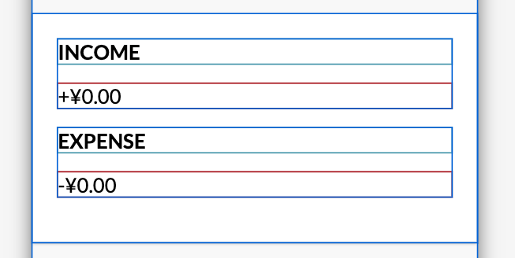

# 11-expense-tracker

### :eyes: demo: [11-demo](https://sincerity628.github.io/back-to-simple/11-expense-tracker/index.html)

---

### :poop: make text uppercase
template:
```html
<body>
  <div class="text">some text</div>
</body>
```
style:
```css
.text {
  text-transform: uppercase;
}
```

---

### :poop: style it
before:



after:


template:
```html
<body>
  <div class="inc-exp-container">
    <div>
      <h4>Income</h4>
      <p>+¥0.00</p>
    </div>
    <div>
      <h4>expense</h4>
      <p>-¥0.00</p>
    </div>
  </div>
</body>
```

style:
```css
.inc-exp-container {
  display: flex;
  justify-content: space-between;
}

/* the direct div(s) inside the '.inc-exp-container' div */
.inc-exp-container > div {
  flex: 1;
  text-align: center;
}
```

---

### :poop: create the button clicking effect
template:
```html
<body>
  <button>click me</button>
</body>
```

style:
```css
button {
  trsnsition: transform 0.1s ease-in-out;
}

button:active {
  transform: scale(0.98);
}
```

---

### :poop: position it & animate it
normal:


hover:


template:
```html
<body>
  <div class="container">
    some content...
    <button>delete button</button>
  </div>
</body>
```
style:
```css
.container {
  position: relative;
}

button {
  /* position */
  position: absolute;
  top: 50%;
  left: 0;
  transfrom: translate(-100%, -50%);
  opacity: 0;
  /* animation */
  transition: opacity 0.2s ease-in;
}

/* condition */
.container:hover button {
  opacity: 1;
}
```
