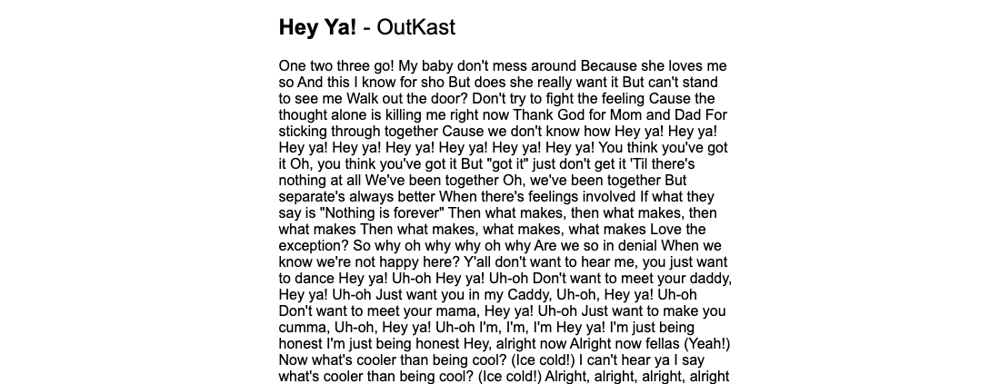
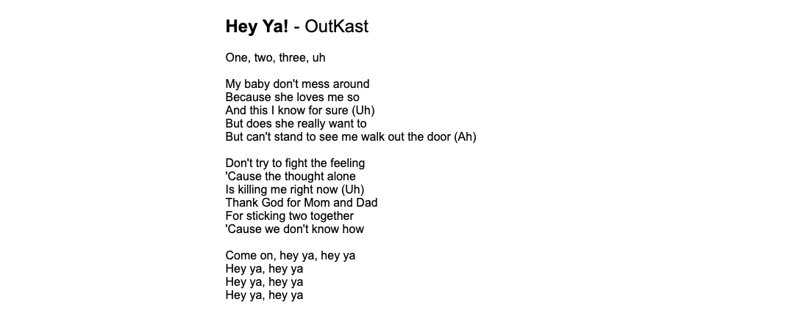

# 15-lyrics-finder

### :eyes: demo: [15-demo](https://sincerity628.github.io/back-to-simple/15-lyrics-finder/index.html)

### :musical_note: api link [(lyrics.ovh)](https://lyricsovh.docs.apiary.io/#reference/0/lyrics-of-a-song/search)

---

### :musical_note: add the overlay effect to the header with background image

template:
```html
<body>
  <header>
    <h1>blah blah...</h1>
    <p>blah blah..</p>
  </header>
</body>
```
style:
```css
header {
  background-image: url(...);
  position: relative;
}

/* ghost element */
header::after {
  content: '';
  background-color: rgba(0, 0, 0, 0.3); /* example */
  position: absolute;
  top: 0;
  left: 0;
  width: 100%;
  height: 100%;
}

/* pull everything in the header on the top */
header * {
  z-index: 1;
}
```

---

### :musical_note: format the lyrics from the api

before:



after:



solution:
```js
// regular expression
const lyrics = data.lyrics.replace(/(\r\n|\r|\n)/g, '<br />');
```
