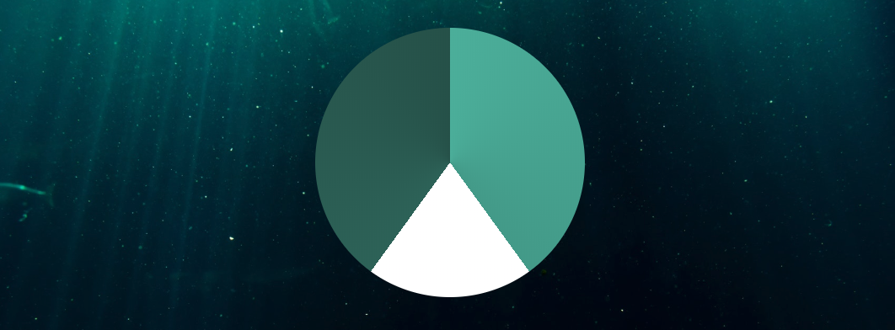

# 16-relaxer-app

### :eyes: demo: [16-demo](https://sincerity628.github.io/back-to-simple/16-relaxer-app/index.html)

---

### :relieved: style the gradient-circle

result:



style:
```css
.gradient-circle {
  background: conic-gradient(
    #55b7a4 0%,
    #4ca493 40%,
    #fff 40%,
    #fff 60%,
    #336d62 60%,
    #2a5b52 100%
  );
  border-radius: 50%;
}
```

---

### :relieved: understand the animation-fill-mode: [link](https://www.w3cplus.com/css3/understanding-css-animation-fill-mode-property.html)

### :relieved: understand the transform-origin: [link](https://developer.mozilla.org/zh-CN/docs/Web/CSS/transform-origin)

result:


style:
```css
.pointer-container {
  animation: rotate 7.5s linear forwards infinite;
  /* animation-fill-mode: forwards; */
  transform-origin: bottom center;
}

@keyframes rotate {
  from {
    transform: rotate(0deg);
  }

  to {
    transform: rotate(360deg);
  }
}
```
