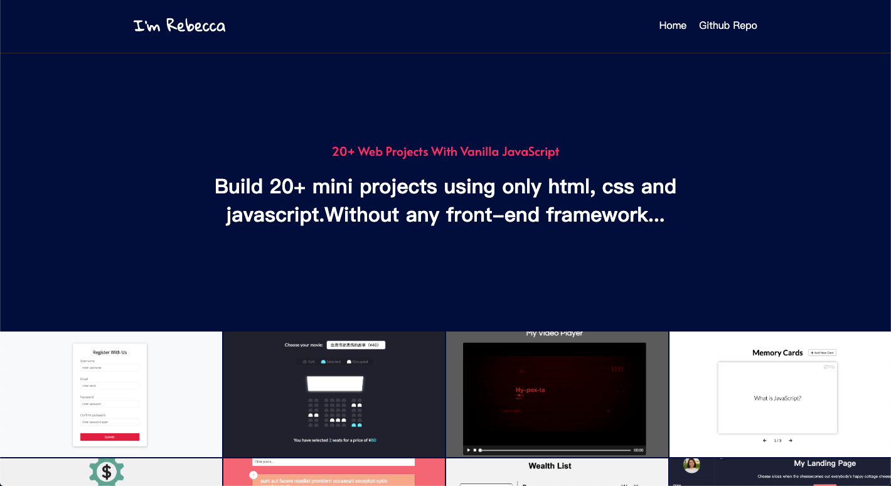

# back-to-simple

#### :see_no_evil: :hear_no_evil: :speak_no_evil: just try to do some projects only using javascript, css and html without any front-end framework to review some basic knowledge.

---

### :eyes: projects website: [link](http://47.98.249.108:3001/)

---

### :eyes: detail list:

- 01-form-validator [detail](https://github.com/sincerity628/back-to-simple/tree/master/01-form-validator)
- 02-movie-seat-booking [detail](https://github.com/sincerity628/back-to-simple/tree/master/02-movie-seat-booking)
- 03-my-video-player [detail](https://github.com/sincerity628/back-to-simple/tree/master/03-my-video-player)
- 04-flip-card [detail](https://github.com/sincerity628/back-to-simple/tree/master/04-flip-card)
- 05-exchange-calculator [detail](https://github.com/sincerity628/back-to-simple/tree/master/05-exchange-calculator)
- 06-infinite-scroll [detail](https://github.com/sincerity628/back-to-simple/tree/master/06-infinite-scroll)
- 07-wealth-list [detail](https://github.com/sincerity628/back-to-simple/tree/master/07-wealth-list)
- 08-menu-slider-and-modal [detail](https://github.com/sincerity628/back-to-simple/tree/master/08-menu-slider-and-modal)
- 09-hangman-game [detail](https://github.com/sincerity628/back-to-simple/tree/master/09-hangman-game)
- 10-meal-finder [detail](https://github.com/sincerity628/back-to-simple/tree/master/10-meal-finder)
- 11-expense-tracker [detail](https://github.com/sincerity628/back-to-simple/tree/master/11-expense-tracker)
- 12-my-music-player [detail](https://github.com/sincerity628/back-to-simple/tree/master/12-my-music-player)
- 13-typing-game [detail](https://github.com/sincerity628/back-to-simple/tree/master/13-typing-game)
- 14-text-reader [detail](https://github.com/sincerity628/back-to-simple/tree/master/14-text-reader)
- 15-lyrics-finder [detail](https://github.com/sincerity628/back-to-simple/tree/master/15-lyrics-finder)
- 16-relaxer-app [detail](https://github.com/sincerity628/back-to-simple/tree/master/16-relaxer-app)
- 17-breakout-game [detail](https://github.com/sincerity628/back-to-simple/tree/master/17-breakout-game)
- 18-new-year-countdown [detail](https://github.com/sincerity628/back-to-simple/tree/master/18-new-year-countdown)
- 19-sortable-list [detail](https://github.com/sincerity628/back-to-simple/tree/master/19-sortable-list)
- 20-number-guess-game [detail](https://github.com/sincerity628/back-to-simple/tree/master/20-number-guess-game)
- 21-particle-effect (used p5.js) [detail](https://github.com/sincerity628/back-to-simple/tree/master/21-particle-effect)
- 22-image-slider [detail](https://github.com/sincerity628/back-to-simple/tree/master/22-image-slider)
---
